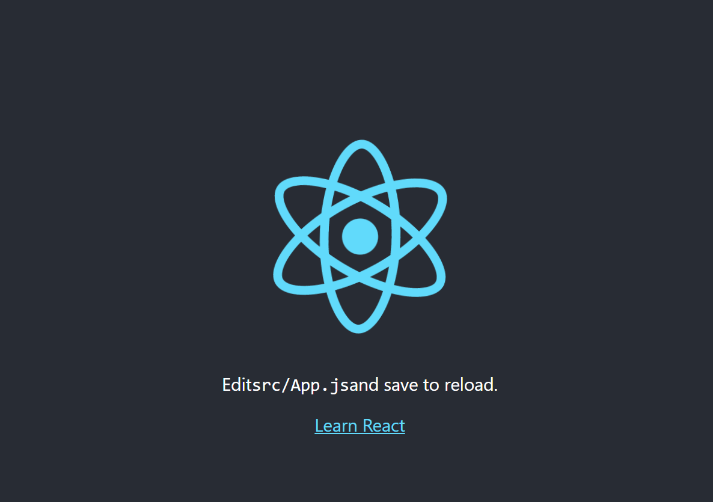

# Portfolio desktop version

- Protfolio: (https://eng-mohamed-eldeeb.github.io/protofolio/)

> this is the setup for the react math porject.
 
## Live Demo

[Live Demo Link](https://eng-mohamed-eldeeb.github.io/Math_Magicians/)

## Clone and review it

Run the following commands to clone and run it.

Additional description about the project and its features.

## Authors

👤 **MOHAMED EL DEEB**

- GitHub: [@githubhandle](https://github.com/eng-mohamed-eldeeb)
- Twitter: [@twitterhandle](https://https://twitter.com/eldeeb_3o)
- LinkedIn: [LinkedIn](https://https://www.linkedin.com/in/mohamed-eldeeb-a69022206/)

## Show your support

Give a ⭐️ if you like this project!

## 📝 License

This project is [MIT](./MIT.md) licensed.